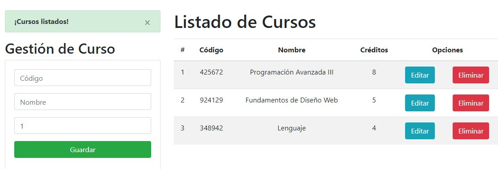

# Django-CRUD-SQLite3

CRUD completo con Python, Django y una base de datos SQLite3, usando el patrón de arquitectura MTV (Modelo - Plantilla - Vista), el ORM de Django, el framework CSS Bootstrap y control de eventos con JavaScript.

 

  

